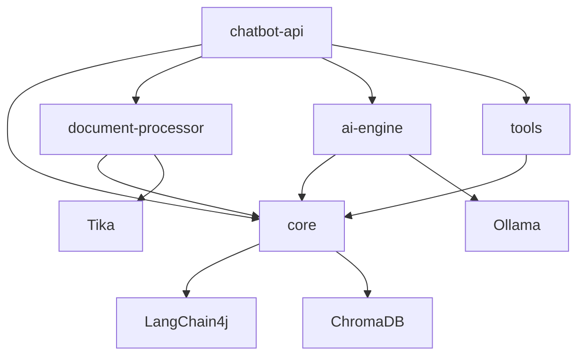

# Chatbot RAG System

A **R**etrieval-**A**ugmented **G**eneration chatbot system built with **Micronaut**, **LangChain4j**, and **Ollama** for local LLM inference. The system supports PDF document indexing, real-time chat via WebSocket, and MCP-compatible tools for enhanced AI capabilities.

## 🏗️ Architecture Overview

This is a clean, modular Micronaut-based multi-module Gradle project optimized for deployment across separate **GPU** (Generative AI) and **CPU** (Agentic AI) instances on Vast.ai.

### **Project Structure**

```
chatbot-rag/
├── gradle/                    # Gradle wrapper & build system
├── gradlew, gradlew.bat      # Build scripts
├── build.gradle              # Root configuration
├── settings.gradle           # Project settings
├── modules/                  # 🎯 All source modules organized here
│   ├── core/                 # Domain models & vector store services
│   ├── document-processor/   # PDF/text processing with Apache Tika
│   ├── ai-engine/           # Ollama integration & RAG services
│   ├── chatbot-api/         # Main Micronaut REST/WebSocket application
│   ├── chatbot-frontend/    # Static web assets (HTML/CSS/JS)
│   └── tools/               # MCP-compatible tools
└── docker/                  # Deployment configurations
    ├── generative/          # GPU instance deployment
    └── agentic/            # CPU instance deployment
```

### **Module Dependencies**



## 🚀 Quick Start

### **Prerequisites**

- **Java 17+** (OpenJDK recommended)
- **Gradle 9.0+** (wrapper included)
- **Docker** (for deployment)
- **Ollama** (for local LLM inference)

### **Build & Run**

```bash
# Clone the repository
git clone <repository-url>
cd chatbot-rag

# Build all modules
./gradlew build

# Run the main application
./gradlew :modules:chatbot-api:run

# Access the web interface
open http://localhost:8080
```

### **Development Commands**

| Command                                | Description                        |
|----------------------------------------|------------------------------------|
| `./gradlew build`                      | Build all modules and run tests    |
| `./gradlew test`                       | Run all tests across modules       |
| `./gradlew clean`                      | Clean build artifacts              |
| `./gradlew :modules:chatbot-api:run`   | Start main application (port 8080) |
| `./gradlew :modules:MODULE_NAME:build` | Build specific module              |

## 🧩 Module Details

### **Core Module** (`modules/core/`)
**Domain models and vector store services**

- **Domain Models**: `Document`, `ChatMessage`, `SearchResult`
- **Services**: `DocumentService`, `EmbeddingService`, `VectorStoreService`
- **Configuration**: ChromaDB vector store, embedding models
- **Dependencies**: LangChain4j, Reactor Core, Micronaut DI

### **Document Processor** (`modules/document-processor/`)
**PDF/text processing with smart chunking**

- **Features**: Multi-format support (PDF, TXT, HTML, Word)
- **Processing**: Apache Tika for metadata extraction
- **Chunking**: Semantic, fixed-size, sentence-based strategies
- **Dependencies**: Apache Tika, JSoup for web scraping

### **AI Engine** (`modules/ai-engine/`)
**Ollama integration and RAG logic**

- **Services**: `ChatService`, `OllamaService`, `RAGService`
- **Features**: Local LLM inference, dynamic prompt building
- **Configuration**: Configurable relevance thresholds, context limits
- **Dependencies**: LangChain4j Ollama, Micronaut HTTP client

### **Chatbot API** (`modules/chatbot-api/`)
**Main Micronaut application**

- **Controllers**: REST Chat API, Document management
- **Features**: WebSocket real-time chat, file upload
- **Endpoints**: `/api/chat`, `/api/documents`
- **Dependencies**: All other modules, Micronaut web stack

### **Frontend** (`modules/chatbot-frontend/`)
**Static web assets**

- **Assets**: HTML/CSS/JS for chatbot interface
- **Features**: WebSocket client, document upload, system info
- **Styling**: Responsive design with modern CSS

### **Tools** (`modules/tools/`)
**MCP-compatible tools**

- **FileSearchTool**: Local file system search and analysis
- **WebSearchTool**: Web scraping with JSoup
- **SystemInfoTool**: System monitoring with OSHI
- **DatabaseTool**: SQL query capabilities (H2)

## 🎯 Technology Stack

| Component               | Technology              | Version |
|-------------------------|-------------------------|---------|
| **Framework**           | Micronaut               | 4.3.5   |
| **Language**            | Java                    | 21      |
| **AI/LLM**              | LangChain4j + Ollama    | 0.35.0  |
| **Vector Store**        | ChromaDB                | Latest  |
| **Document Processing** | Apache Tika + PDFBox    | 2.9.1   |
| **Frontend**            | HTML/CSS/JS + WebSocket | -       |
| **Build System**        | Gradle Multi-Module     | 9.0+    |
| **Deployment**          | Docker + Vast.ai        | -       |

## 🔧 Configuration

### **Application Profiles**

The system supports two deployment profiles:

- **`generative`**: GPU instance profile (Ollama + Vector Store + RAG)
- **`agentic`**: CPU instance profile (API + Frontend + Tools)

### **Key Configuration Properties**

```yaml
# Core module configuration
core:
  vector-store:
    host: localhost
    port: 8000
    collection: documents
    dimension: 384
  embedding:
    model: sentence-transformers/all-MiniLM-L6-v2

# AI engine configuration  
ai:
  ollama:
    host: localhost
    port: 11434
    default-model: llama3.2
    timeout: 60000
  rag:
    max-context-results: 5
    relevance-threshold: 0.7
    max-context-length: 4000
```

## 🐳 Deployment

### **Local Development**

#### **Vector**

```bash
docker volume create pgdata_chatbot_rag
docker run -d --name pgvector_chatbot_rag -v pgdata_chatbot_rag:/var/lib/postgresql/data \
  -p 54320:5432 -e POSTGRES_PASSWORD=postgres \
  -e POSTGRES_USER=postgres \
  -e POSTGRES_DB=chatbot_rag_db pgvector/pgvector:pg16
```

The schema:

```sql
-- 1. pgvector Extension aktivieren
CREATE EXTENSION IF NOT EXISTS vector;

-- 2. Eigenes Schema erstellen
CREATE SCHEMA IF NOT EXISTS chatbot_rag;

-- 3. Sequences im eigenen Schema erstellen
CREATE SEQUENCE chatbot_rag.document_text_seq;
CREATE SEQUENCE chatbot_rag.document_text_chunk_seq;

-- 4. document_text Tabelle im eigenen Schema
CREATE TABLE chatbot_rag.document_text (
    id BIGINT PRIMARY KEY DEFAULT nextval('chatbot_rag.document_text_id_seq'),
    file_name VARCHAR(500) UNIQUE NOT NULL,
    file_path TEXT,
    file_size BIGINT,
    mime_type VARCHAR(100),
    content TEXT NOT NULL,
    content_hash VARCHAR(64),                        -- SHA-256 Hash des Contents
    file_hash VARCHAR(64),                           -- SHA-256 Hash der Originaldatei
    metadata JSONB DEFAULT '{}',
    processing_status VARCHAR(50) DEFAULT 'pending',
    last_modified TIMESTAMP,                         -- Letzte Änderung der Originaldatei
    created_at TIMESTAMP DEFAULT NOW(),
    updated_at TIMESTAMP DEFAULT NOW()
);

-- 5. document_text_Chunk Tabelle im eigenen Schema
CREATE TABLE chatbot_rag.document_text_chunk (
    id BIGINT PRIMARY KEY DEFAULT nextval('chatbot_rag.document_text_chunk_id_seq'),
    document_text_id BIGINT NOT NULL REFERENCES chatbot_rag.document_text(id) ON DELETE CASCADE,
    filename VARCHAR(500) NOT NULL,
    chunk_index INTEGER NOT NULL,
    content TEXT NOT NULL,
    embedding vector(384),
    metadata JSONB DEFAULT '{}',
    created_at TIMESTAMP DEFAULT NOW(),
    UNIQUE(document_text_id, chunk_index)
);

-- 6. Indexes im eigenen Schema erstellen
CREATE INDEX idx_document_text_filename ON chatbot_rag.document_text(filename);
CREATE INDEX idx_document_text_status ON chatbot_rag.document_text(processing_status);
CREATE INDEX idx_document_text_created ON chatbot_rag.document_text(created_at);
CREATE INDEX idx_document_text_content_hash ON chatbot_rag.document_text(content_hash);
CREATE INDEX idx_document_text_file_hash ON chatbot_rag.document_text(file_hash);
CREATE INDEX idx_document_text_metadata ON chatbot_rag.document_text USING GIN(metadata);

CREATE INDEX idx_document_text_chunk_document_text_id ON chatbot_rag.document_text_chunk(document_text_id);
CREATE INDEX idx_document_text_chunk_filename ON chatbot_rag.document_text_chunk(filename);
CREATE INDEX idx_document_text_chunk_token_count ON chatbot_rag.document_text_chunk(token_count);
CREATE INDEX idx_document_text_chunk_embedding ON chatbot_rag.document_text_chunk 
    USING ivfflat (embedding vector_cosine_ops) WITH (lists = 100);
CREATE INDEX idx_document_text_chunk_content_fulltext_de ON chatbot_rag.document_text_chunk 
    USING GIN(to_tsvector('german', content));
```

#### **AI**

```bash
# Start Ollama (if not running)
ollama serve
ollama pull nextfire/paraphrase-multilingual-minilm:l12-v2
```

#### **Embedding**

```bash
# Pull a model (example)
ollama pull llama3.2

# Start ChromaDB (Docker)
docker run -p 8000:8000 chromadb/chroma

# Run the application
./gradlew :modules:chatbot-api:run
```

### **Docker Deployment**

```bash
# Build for different deployment profiles
./gradlew buildGenerative    # GPU-intensive deployment
./gradlew buildAgentic       # CPU-based deployment

# Build Docker images
./gradlew dockerBuildAll

# Deploy to Vast.ai
./gradlew deployVastAI \
  -Dgenerative.instance.id=12345 \
  -Dagentic.instance.id=67890 \
  -Dgenerative.host=1.2.3.4
```

### **Vast.ai Architecture**

#### **Generative AI Instance (GPU)**
- **Hardware**: RTX 4090, 24GB VRAM, 8+ CPU Cores, 32GB RAM
- **Services**: Ollama + LLM Models, ChromaDB Vector Store, RAG Processing
- **Ports**: 8080 (API), 11434 (Ollama)

#### **Agentic AI Instance (CPU)**
- **Hardware**: 4+ CPU Cores, 8GB RAM
- **Services**: Chatbot API + Frontend, MCP Tools, WebSocket Handler
- **Ports**: 8080 (Web UI), 80/443 (Nginx)

## 🧪 Testing

```bash
# Run all tests
./gradlew test

# Run tests for specific module
./gradlew :modules:core:test

# Run with coverage
./gradlew test jacocoTestReport
```

## 📖 API Documentation

### **REST Endpoints**

| Method   | Endpoint                        | Description              |
|----------|---------------------------------|------------- -------------|
| `POST`   | `/api/chat`                     | Send chat message        |
| `GET`    | `/api/chat/{sessionId}/history` | Get conversation history |
| `DELETE` | `/api/chat/{sessionId}`         | Clear conversation       |
| `GET`    | `/api/documents`                | List all documents       |
| `GET`    | `/api/documents/{id}`           | Get specific document    |
| `DELETE` | `/api/documents/{id}`           | Delete document          |

### **WebSocket**

- **Endpoint**: `/ws/chat`
- **Purpose**: Real-time chat communication
- **Format**: JSON messages with `ChatRequest`/`ChatResponse`

## 🛠️ Development

### **Adding New Modules**

1. Create module directory in `modules/`
2. Add module to `settings.gradle`
3. Configure dependencies in module's `build.gradle`
4. Update root `build.gradle` if needed

### **Code Style**

- **Java**: Follow standard Java conventions
- **Dependencies**: Use `:modules:module-name` format
- **Configuration**: Use Micronaut's configuration injection
- **Testing**: JUnit 5 with Micronaut Test

## 🤝 Contributing

1. Fork the repository
2. Create a feature branch
3. Make your changes
4. Add tests for new functionality
5. Run `./gradlew build` to ensure everything builds
6. Submit a pull request

## 📄 License

This project is licensed under the MIT License - see the [LICENSE](LICENSE) file for details.

## 🔗 Links

- [Micronaut Documentation](https://docs.micronaut.io/)
- [LangChain4j Documentation](https://docs.langchain4j.dev/)
- [Ollama Documentation](https://ollama.com/docs/)
- [ChromaDB Documentation](https://docs.trychroma.com/)
- [Vast.ai Documentation](https://vast.ai/docs/)

---

**Built with ❤️ using Micronaut, LangChain4j, and Ollama**